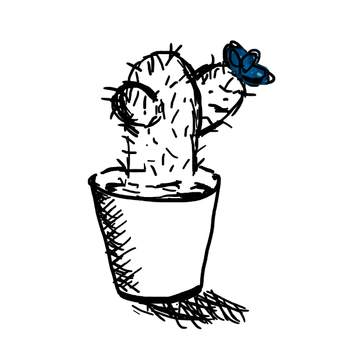

# Pexeso
Pexeso is a C# project that implements a classic pairs game, also known as Concentration or Memory. It allows players to test their memory skills by matching pairs of cards with identical designs. What sets Pexeso apart is that it features a unique hand-designed cards, adding a kind of personal touch to the game.



## Getting started
To run Pexeso locally, follow these steps:

1. Clone the repository to your local machine using the following command:
```shell
git clone https://github.com/zuzavop/pexeso.git
```
2. Open the solution file Pexeso.sln in your preferred C# development environment (e.g., Visual Studio).

3. Build the solution to ensure all dependencies are resolved.

4. Start the game by running the application.
